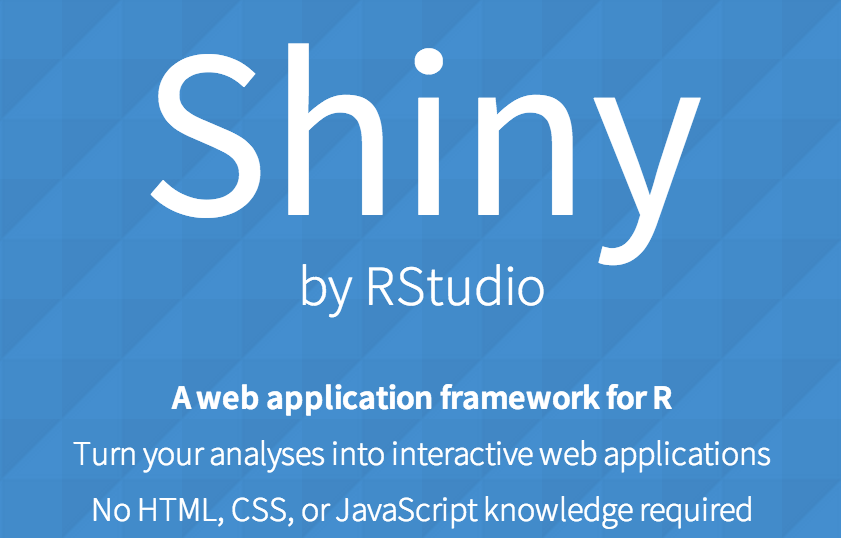
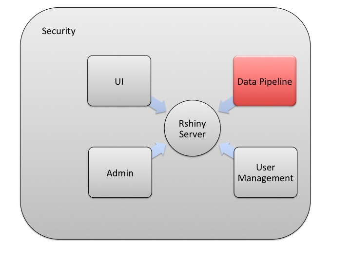
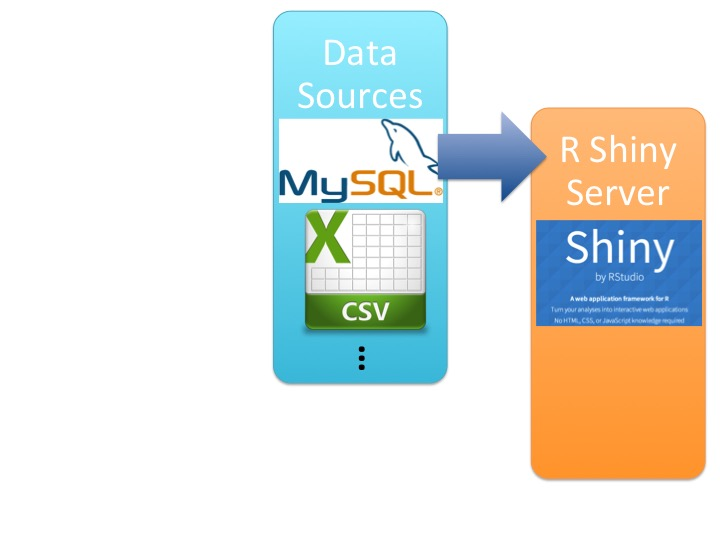

## Who Are We

 - Analytics team that supports [eBay Partern Network](http://www.ebaypartnernetwork.com) (ePN).

  <div style='text-align: center;'>
      
  </div>

```{r setOptions, echo=FALSE}
library(googleVis)
setwd('/Users/chengliu/Rshiny/')
stock <- read.csv('/Users/chengliu/Rshiny/data/ebay.csv', stringsAsFactors = F)
stock$Date <- as.Date(stock$Date, '%m/%d/%y')
```

---

## Who Are We

 - We actively engage with business unit to find business insight across the network.
 
  <div style='text-align: center;'>
      
  </div>

---

## Analytics: Ideal Vs. Reality

```{r opts.label = 'interactive', results = 'asis', echo=FALSE}
  P1 <- gvisPieChart(data.frame(Activity=c('Data Processing', 'Finding Data Insight'), Per=c(20, 80)), options=list(title='', legend="{position: \'labeled\'}", pieSliceText='none', height=500, width=1000))
  print(P1, tag = 'chart')
```

---

## Analytics: Ideal Vs. Reality

```{r opts.label = 'interactive', results = 'asis', echo=FALSE}
  P2 <- gvisPieChart(data.frame(Activity=c('Data Processing', 'Finding Data Insight'), Per=c(80, 20)), options=list(title='', legend="{position: \'labeled\'}", pieSliceText='none', height=500, width=1000))
  print(P2, tag = 'chart')
```

---

## Layers of Reporting

  - Raw data
 
  - Static reports: Excel, HTML
 
  - Trandional dashboards: Tableau, Microstrategy
 
  - <font color = 'blue'> New dashboards/platforms: R Shiny Server</font>

---

## What is Shiny

  -  [Shiny](http://shiny.rstudio.com/) by [Rstudio](http://www.rstudio.com/) is a web application framework for R

  <div style='text-align: center;'>
      
  </div>
  
  <div>
    <iframe src = 'http://orangelliu.shinyapps.io/TextBook/'></iframe>
  </div>

---

## R package: googleVis

  - [googleVis](http://cran.r-project.org/web/packages/googleVis/vignettes/googleVis_examples.html) Provide interface between [R](http://www.r-project.org/) and [Google Charts](https://developers.google.com/chart/).

```{r, echo=F, fig.align='center'}
  plot(stock$Date, stock$Open, type='l', col='blue', xlab='Date', ylab='Price', main='eBay Inc. Stock Open Price')
  points(stock$Date, stock$Open, pch=16, cex=1)
```

---

## R package: googleVis

  - [googleVis](http://cran.r-project.org/web/packages/googleVis/vignettes/googleVis_examples.html) Provide interface between [R](http://www.r-project.org/) and [Google Charts](https://developers.google.com/chart/).

```{r opts.label = 'interactive', results = 'asis', echo=FALSE}
  line_plot <- gvisLineChart(stock, xvar='Date', yvar=c('Open', 'Volume'), options=list(title='eBay Inc. Stock Open Price', height=500, width=900, series="[{targetAxisIndex: 0, pointSize: 6}, {targetAxisIndex:1, pointSize: 6}]", vAxis="[{format:'$#,###0.0'}, {format:'#,###'}]", legend = "bottom"))

print(line_plot, tag = 'chart')
```

---

## R package: googleVis

  - HTML attributes are accepted
  
```{r, eval=FALSE}
<p style="background-color:Aquamarine"></p>
```

- 

```{r opts.label = 'interactive', results = 'asis', echo=FALSE}
  stock_table <- stock
  for(i in 1:nrow(stock_table)){
      if(i == 1){
        Change <- NA
      }else{
        Change <- round(100*(stock_table[i, 'Open'] - stock_table[i-1, 'Open']) / stock_table[i-1, 'Open'], digit=1)
      }
      if(is.na(Change)){
          text_out <- ''
      }else if(Change==0){
        text_out <- Change
      }else if(Change>0){
        text_out <- paste('<p style=\"background-color:Aquamarine;text-align:right\">', Change, '%', sep='')
      }else{
        text_out <- paste('<p style=\"background-color:Pink;text-align:right\">', Change, '%', sep='')
      }
      text_out <- paste(text_out, '</p>')
      stock_table$'DoD Change'[i] <-text_out
  }
  stock_table$Date <- as.character(stock_table$Date)
  stock_table$Open <- paste('<p style=\"text-align:right\">$', stock_table$Open, sep='')
  stock_table <- stock_table[,c('Date', 'Open', 'DoD Change')]
  table_plot <- gvisTable(stock_table, options=list(allowHtml=TRUE, vAxis="{format:'$#,#0.0'}", 
    page='enable', pageSize=7))
  print(table_plot, tag = 'chart')
```

---

## Shiny Provides Nice Control Widgets

  <div>
    <iframe src = 'http://orangelliu.shinyapps.io/Widget'></iframe>
  </div>

---

## ... and More Widgets

  <div>
    <iframe src = 'http://orangelliu.shinyapps.io/Widget2/'></iframe>
  </div>
  
---

---

## More Advanced Dashboards

  <div>
    <iframe src = 'http://orangelliu.shinyapps.io/Stacked/'></iframe>
  </div>

---

## More Advanced Dashboards

  <div>
    <iframe src = 'http://orangelliu.shinyapps.io/Waterfall'></iframe>
  </div>

---

## More Advanced Dashboards

  <div>
    <iframe src = 'http://orangelliu.shinyapps.io/Weather'></iframe>
  </div>

---

## More Advanced Dashboards

- Building platform

- Download/<font color = 'blue'>Upload</font> raw data

- Direct connection to DW

- [R Web-based Console](http://10.9.202.204:8787/)

---

## Benifits

- Powerful (R Based)

- Highly customizable

- No JavaScript or HTML experience is required

- <font color = 'blue'>Zero</font> cost for open source edition ($9,995/year for Pro)

---

## How to Make a Good Dashboard

<div style='text-align: center;'>
      
</div>

---

## How to Make a Good Dashboard

<div style='text-align: center;'>
      
</div>

---

## How to Make a Good Dashboard

<div style='text-align: center;'>
      
</div>

---

## How to Make a Good Dashboard

<div style='text-align: center;'>
      
</div>

---

## How to Make a Good Dashboard

<div style='text-align: center;'>
      
</div>

---

## How to Make a Good Dashboard

<div style='text-align: center;'>
      
</div>

---

## How to Make a Good Dashboard

<p>&nbsp</p>
<p>&nbsp</p>
<p style="text-align:center"><font size='6'><b>A user interface (<font color = 'blue'> A dashboard</font>) is like a joke.</b></font></p>
<p style="text-align:center"><font size='6'><b>If you have to explain it,</b></font></p>
<p style="text-align:center"><font size='6'><b>it’s not that good.</b></font></p>

---

<p>&nbsp</p>
<p>&nbsp</p>
<p>&nbsp</p>
<p>&nbsp</p>
<p>&nbsp</p>
<p>&nbsp</p>
<p>&nbsp</p>
<p style="text-align:center"><font size='50'><b>Thank you!</b></font></h1>
<p>&nbsp</p>
<p style="text-align:center"><font size='5'><b>Cheng Liu: orangelliu@gmail.com</b></font></p>
