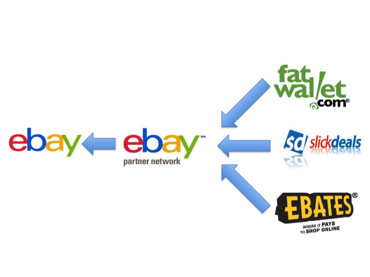
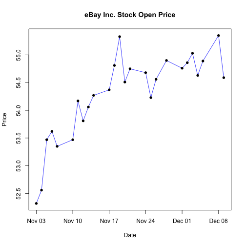

## Who Are We

 - Analytics team that supports [eBay Partern Network](http://www.ebaypartnernetwork.com) (ePN).

  <div style='text-align: center;'>
      
  </div>


---

## Who Are We

 - We actively engage with business unit to find business insight across the network.
 
  <div style='text-align: center;'>
      
  </div>

---

## Analytics: Ideal Vs. Reality

<!-- PieChart generated in R 3.0.2 by googleVis 0.5.7 package -->
<!-- Sun Jan 25 21:46:15 2015 -->


<!-- jsHeader -->
<script type="text/javascript">
 
// jsData 
function gvisDataPieChartID2a665c839b63 () {
var data = new google.visualization.DataTable();
var datajson =
[
 [
 "Data Processing",
20 
],
[
 "Finding Data Insight",
80 
] 
];
data.addColumn('string','Activity');
data.addColumn('number','Per');
data.addRows(datajson);
return(data);
}
 
// jsDrawChart
function drawChartPieChartID2a665c839b63() {
var data = gvisDataPieChartID2a665c839b63();
var options = {};
options["allowHtml"] = true;
options["title"] = "";
options["legend"] = {position: 'labeled'};
options["pieSliceText"] = "none";
options["height"] =    500;
options["width"] =   1000;

    var chart = new google.visualization.PieChart(
    document.getElementById('PieChartID2a665c839b63')
    );
    chart.draw(data,options);
    

}
  
 
// jsDisplayChart
(function() {
var pkgs = window.__gvisPackages = window.__gvisPackages || [];
var callbacks = window.__gvisCallbacks = window.__gvisCallbacks || [];
var chartid = "corechart";
  
// Manually see if chartid is in pkgs (not all browsers support Array.indexOf)
var i, newPackage = true;
for (i = 0; newPackage && i < pkgs.length; i++) {
if (pkgs[i] === chartid)
newPackage = false;
}
if (newPackage)
  pkgs.push(chartid);
  
// Add the drawChart function to the global list of callbacks
callbacks.push(drawChartPieChartID2a665c839b63);
})();
function displayChartPieChartID2a665c839b63() {
  var pkgs = window.__gvisPackages = window.__gvisPackages || [];
  var callbacks = window.__gvisCallbacks = window.__gvisCallbacks || [];
  window.clearTimeout(window.__gvisLoad);
  // The timeout is set to 100 because otherwise the container div we are
  // targeting might not be part of the document yet
  window.__gvisLoad = setTimeout(function() {
  var pkgCount = pkgs.length;
  google.load("visualization", "1", { packages:pkgs, callback: function() {
  if (pkgCount != pkgs.length) {
  // Race condition where another setTimeout call snuck in after us; if
  // that call added a package, we must not shift its callback
  return;
}
while (callbacks.length > 0)
callbacks.shift()();
} });
}, 100);
}
 
// jsFooter
</script>
 
<!-- jsChart -->  
<script type="text/javascript" src="https://www.google.com/jsapi?callback=displayChartPieChartID2a665c839b63"></script>
 
<!-- divChart -->
  
<div id="PieChartID2a665c839b63" 
  style="width: 1000; height: 500;">
</div>

---

## Analytics: Ideal Vs. Reality

<!-- PieChart generated in R 3.0.2 by googleVis 0.5.7 package -->
<!-- Sun Jan 25 21:46:15 2015 -->


<!-- jsHeader -->
<script type="text/javascript">
 
// jsData 
function gvisDataPieChartID2a66444eb008 () {
var data = new google.visualization.DataTable();
var datajson =
[
 [
 "Data Processing",
80 
],
[
 "Finding Data Insight",
20 
] 
];
data.addColumn('string','Activity');
data.addColumn('number','Per');
data.addRows(datajson);
return(data);
}
 
// jsDrawChart
function drawChartPieChartID2a66444eb008() {
var data = gvisDataPieChartID2a66444eb008();
var options = {};
options["allowHtml"] = true;
options["title"] = "";
options["legend"] = {position: 'labeled'};
options["pieSliceText"] = "none";
options["height"] =    500;
options["width"] =   1000;

    var chart = new google.visualization.PieChart(
    document.getElementById('PieChartID2a66444eb008')
    );
    chart.draw(data,options);
    

}
  
 
// jsDisplayChart
(function() {
var pkgs = window.__gvisPackages = window.__gvisPackages || [];
var callbacks = window.__gvisCallbacks = window.__gvisCallbacks || [];
var chartid = "corechart";
  
// Manually see if chartid is in pkgs (not all browsers support Array.indexOf)
var i, newPackage = true;
for (i = 0; newPackage && i < pkgs.length; i++) {
if (pkgs[i] === chartid)
newPackage = false;
}
if (newPackage)
  pkgs.push(chartid);
  
// Add the drawChart function to the global list of callbacks
callbacks.push(drawChartPieChartID2a66444eb008);
})();
function displayChartPieChartID2a66444eb008() {
  var pkgs = window.__gvisPackages = window.__gvisPackages || [];
  var callbacks = window.__gvisCallbacks = window.__gvisCallbacks || [];
  window.clearTimeout(window.__gvisLoad);
  // The timeout is set to 100 because otherwise the container div we are
  // targeting might not be part of the document yet
  window.__gvisLoad = setTimeout(function() {
  var pkgCount = pkgs.length;
  google.load("visualization", "1", { packages:pkgs, callback: function() {
  if (pkgCount != pkgs.length) {
  // Race condition where another setTimeout call snuck in after us; if
  // that call added a package, we must not shift its callback
  return;
}
while (callbacks.length > 0)
callbacks.shift()();
} });
}, 100);
}
 
// jsFooter
</script>
 
<!-- jsChart -->  
<script type="text/javascript" src="https://www.google.com/jsapi?callback=displayChartPieChartID2a66444eb008"></script>
 
<!-- divChart -->
  
<div id="PieChartID2a66444eb008" 
  style="width: 1000; height: 500;">
</div>

---

## Layers of Reporting

  - Raw data
 
  - Static reports: Excel, HTML
 
  - Trandional dashboards: Tableau, Microstrategy
 
  - <font color = 'blue'> New dashboards/platforms: R Shiny Server</font>

---

## What is Shiny

  -  [Shiny](http://shiny.rstudio.com/) by [Rstudio](http://www.rstudio.com/) is a web application framework for R

  <div style='text-align: center;'>
      
  </div>
  
  <div>
    <iframe src = 'http://orangelliu.shinyapps.io/TextBook/'></iframe>
  </div>

---

## R package: googleVis

  - [googleVis](http://cran.r-project.org/web/packages/googleVis/vignettes/googleVis_examples.html) Provide interface between [R](http://www.r-project.org/) and [Google Charts](https://developers.google.com/chart/).



---

## R package: googleVis

  - [googleVis](http://cran.r-project.org/web/packages/googleVis/vignettes/googleVis_examples.html) Provide interface between [R](http://www.r-project.org/) and [Google Charts](https://developers.google.com/chart/).

<!-- LineChart generated in R 3.0.2 by googleVis 0.5.7 package -->
<!-- Sun Jan 25 21:22:51 2015 -->


<!-- jsHeader -->
<script type="text/javascript">
 
// jsData 
function gvisDataLineChartID293e67522b3b () {
var data = new google.visualization.DataTable();
var datajson =
[
 [
 new Date(2014,10,3),
52.32,
6985900 
],
[
 new Date(2014,10,4),
52.56,
7727900 
],
[
 new Date(2014,10,5),
53.47,
10761800 
],
[
 new Date(2014,10,6),
53.62,
5893400 
],
[
 new Date(2014,10,7),
53.35,
5415100 
],
[
 new Date(2014,10,10),
53.47,
5264800 
],
[
 new Date(2014,10,11),
54.17,
7094800 
],
[
 new Date(2014,10,12),
53.81,
6058900 
],
[
 new Date(2014,10,13),
54.06,
7812900 
],
[
 new Date(2014,10,14),
54.27,
4971300 
],
[
 new Date(2014,10,17),
54.37,
7775000 
],
[
 new Date(2014,10,18),
54.81,
6966200 
],
[
 new Date(2014,10,19),
55.33,
6721400 
],
[
 new Date(2014,10,20),
54.51,
5554200 
],
[
 new Date(2014,10,21),
54.75,
8439900 
],
[
 new Date(2014,10,24),
54.68,
6067100 
],
[
 new Date(2014,10,25),
54.23,
6635400 
],
[
 new Date(2014,10,26),
54.56,
3989500 
],
[
 new Date(2014,10,28),
54.9,
2969600 
],
[
 new Date(2014,11,1),
54.76,
6802300 
],
[
 new Date(2014,11,2),
54.86,
5964300 
],
[
 new Date(2014,11,3),
55.03,
5359800 
],
[
 new Date(2014,11,4),
54.63,
5646600 
],
[
 new Date(2014,11,5),
54.89,
5588500 
],
[
 new Date(2014,11,8),
55.35,
13072400 
],
[
 new Date(2014,11,9),
54.59,
10997600 
] 
];
data.addColumn('date','Date');
data.addColumn('number','Open');
data.addColumn('number','Volume');
data.addRows(datajson);
return(data);
}
 
// jsDrawChart
function drawChartLineChartID293e67522b3b() {
var data = gvisDataLineChartID293e67522b3b();
var options = {};
options["allowHtml"] = true;
options["title"] = "eBay Inc. Stock Open Price";
options["height"] =    500;
options["width"] =    900;
options["series"] = [{targetAxisIndex: 0, pointSize: 6}, {targetAxisIndex:1, pointSize: 6}];
options["vAxis"] = [{format:'$#,###0.0'}, {format:'#,###'}];
options["legend"] = "bottom";

    var chart = new google.visualization.LineChart(
    document.getElementById('LineChartID293e67522b3b')
    );
    chart.draw(data,options);
    

}
  
 
// jsDisplayChart
(function() {
var pkgs = window.__gvisPackages = window.__gvisPackages || [];
var callbacks = window.__gvisCallbacks = window.__gvisCallbacks || [];
var chartid = "corechart";
  
// Manually see if chartid is in pkgs (not all browsers support Array.indexOf)
var i, newPackage = true;
for (i = 0; newPackage && i < pkgs.length; i++) {
if (pkgs[i] === chartid)
newPackage = false;
}
if (newPackage)
  pkgs.push(chartid);
  
// Add the drawChart function to the global list of callbacks
callbacks.push(drawChartLineChartID293e67522b3b);
})();
function displayChartLineChartID293e67522b3b() {
  var pkgs = window.__gvisPackages = window.__gvisPackages || [];
  var callbacks = window.__gvisCallbacks = window.__gvisCallbacks || [];
  window.clearTimeout(window.__gvisLoad);
  // The timeout is set to 100 because otherwise the container div we are
  // targeting might not be part of the document yet
  window.__gvisLoad = setTimeout(function() {
  var pkgCount = pkgs.length;
  google.load("visualization", "1", { packages:pkgs, callback: function() {
  if (pkgCount != pkgs.length) {
  // Race condition where another setTimeout call snuck in after us; if
  // that call added a package, we must not shift its callback
  return;
}
while (callbacks.length > 0)
callbacks.shift()();
} });
}, 100);
}
 
// jsFooter
</script>
 
<!-- jsChart -->  
<script type="text/javascript" src="https://www.google.com/jsapi?callback=displayChartLineChartID293e67522b3b"></script>
 
<!-- divChart -->
  
<div id="LineChartID293e67522b3b" 
  style="width: 900; height: 500;">
</div>

---

## R package: googleVis

  - HTML attributes are accepted
  

```r
<p style="background-color:Aquamarine"></p>
```

- 

<!-- Table generated in R 3.0.2 by googleVis 0.5.7 package -->
<!-- Sun Jan 25 21:22:51 2015 -->


<!-- jsHeader -->
<script type="text/javascript">
 
// jsData 
function gvisDataTableID293e4394637b () {
var data = new google.visualization.DataTable();
var datajson =
[
 [
 "2014-11-03",
"<p style=\"text-align:right\">$52.32",
" </p>" 
],
[
 "2014-11-04",
"<p style=\"text-align:right\">$52.56",
"<p style=\"background-color:Aquamarine;text-align:right\">0.5% </p>" 
],
[
 "2014-11-05",
"<p style=\"text-align:right\">$53.47",
"<p style=\"background-color:Aquamarine;text-align:right\">1.7% </p>" 
],
[
 "2014-11-06",
"<p style=\"text-align:right\">$53.62",
"<p style=\"background-color:Aquamarine;text-align:right\">0.3% </p>" 
],
[
 "2014-11-07",
"<p style=\"text-align:right\">$53.35",
"<p style=\"background-color:Pink;text-align:right\">-0.5% </p>" 
],
[
 "2014-11-10",
"<p style=\"text-align:right\">$53.47",
"<p style=\"background-color:Aquamarine;text-align:right\">0.2% </p>" 
],
[
 "2014-11-11",
"<p style=\"text-align:right\">$54.17",
"<p style=\"background-color:Aquamarine;text-align:right\">1.3% </p>" 
],
[
 "2014-11-12",
"<p style=\"text-align:right\">$53.81",
"<p style=\"background-color:Pink;text-align:right\">-0.7% </p>" 
],
[
 "2014-11-13",
"<p style=\"text-align:right\">$54.06",
"<p style=\"background-color:Aquamarine;text-align:right\">0.5% </p>" 
],
[
 "2014-11-14",
"<p style=\"text-align:right\">$54.27",
"<p style=\"background-color:Aquamarine;text-align:right\">0.4% </p>" 
],
[
 "2014-11-17",
"<p style=\"text-align:right\">$54.37",
"<p style=\"background-color:Aquamarine;text-align:right\">0.2% </p>" 
],
[
 "2014-11-18",
"<p style=\"text-align:right\">$54.81",
"<p style=\"background-color:Aquamarine;text-align:right\">0.8% </p>" 
],
[
 "2014-11-19",
"<p style=\"text-align:right\">$55.33",
"<p style=\"background-color:Aquamarine;text-align:right\">0.9% </p>" 
],
[
 "2014-11-20",
"<p style=\"text-align:right\">$54.51",
"<p style=\"background-color:Pink;text-align:right\">-1.5% </p>" 
],
[
 "2014-11-21",
"<p style=\"text-align:right\">$54.75",
"<p style=\"background-color:Aquamarine;text-align:right\">0.4% </p>" 
],
[
 "2014-11-24",
"<p style=\"text-align:right\">$54.68",
"<p style=\"background-color:Pink;text-align:right\">-0.1% </p>" 
],
[
 "2014-11-25",
"<p style=\"text-align:right\">$54.23",
"<p style=\"background-color:Pink;text-align:right\">-0.8% </p>" 
],
[
 "2014-11-26",
"<p style=\"text-align:right\">$54.56",
"<p style=\"background-color:Aquamarine;text-align:right\">0.6% </p>" 
],
[
 "2014-11-28",
"<p style=\"text-align:right\">$54.9",
"<p style=\"background-color:Aquamarine;text-align:right\">0.6% </p>" 
],
[
 "2014-12-01",
"<p style=\"text-align:right\">$54.76",
"<p style=\"background-color:Pink;text-align:right\">-0.3% </p>" 
],
[
 "2014-12-02",
"<p style=\"text-align:right\">$54.86",
"<p style=\"background-color:Aquamarine;text-align:right\">0.2% </p>" 
],
[
 "2014-12-03",
"<p style=\"text-align:right\">$55.03",
"<p style=\"background-color:Aquamarine;text-align:right\">0.3% </p>" 
],
[
 "2014-12-04",
"<p style=\"text-align:right\">$54.63",
"<p style=\"background-color:Pink;text-align:right\">-0.7% </p>" 
],
[
 "2014-12-05",
"<p style=\"text-align:right\">$54.89",
"<p style=\"background-color:Aquamarine;text-align:right\">0.5% </p>" 
],
[
 "2014-12-08",
"<p style=\"text-align:right\">$55.35",
"<p style=\"background-color:Aquamarine;text-align:right\">0.8% </p>" 
],
[
 "2014-12-09",
"<p style=\"text-align:right\">$54.59",
"<p style=\"background-color:Pink;text-align:right\">-1.4% </p>" 
] 
];
data.addColumn('string','Date');
data.addColumn('string','Open');
data.addColumn('string','DoD Change');
data.addRows(datajson);
return(data);
}
 
// jsDrawChart
function drawChartTableID293e4394637b() {
var data = gvisDataTableID293e4394637b();
var options = {};
options["allowHtml"] = true;
options["vAxis"] = {format:'$#,#0.0'};
options["page"] = "enable";
options["pageSize"] =      7;

    var chart = new google.visualization.Table(
    document.getElementById('TableID293e4394637b')
    );
    chart.draw(data,options);
    

}
  
 
// jsDisplayChart
(function() {
var pkgs = window.__gvisPackages = window.__gvisPackages || [];
var callbacks = window.__gvisCallbacks = window.__gvisCallbacks || [];
var chartid = "table";
  
// Manually see if chartid is in pkgs (not all browsers support Array.indexOf)
var i, newPackage = true;
for (i = 0; newPackage && i < pkgs.length; i++) {
if (pkgs[i] === chartid)
newPackage = false;
}
if (newPackage)
  pkgs.push(chartid);
  
// Add the drawChart function to the global list of callbacks
callbacks.push(drawChartTableID293e4394637b);
})();
function displayChartTableID293e4394637b() {
  var pkgs = window.__gvisPackages = window.__gvisPackages || [];
  var callbacks = window.__gvisCallbacks = window.__gvisCallbacks || [];
  window.clearTimeout(window.__gvisLoad);
  // The timeout is set to 100 because otherwise the container div we are
  // targeting might not be part of the document yet
  window.__gvisLoad = setTimeout(function() {
  var pkgCount = pkgs.length;
  google.load("visualization", "1", { packages:pkgs, callback: function() {
  if (pkgCount != pkgs.length) {
  // Race condition where another setTimeout call snuck in after us; if
  // that call added a package, we must not shift its callback
  return;
}
while (callbacks.length > 0)
callbacks.shift()();
} });
}, 100);
}
 
// jsFooter
</script>
 
<!-- jsChart -->  
<script type="text/javascript" src="https://www.google.com/jsapi?callback=displayChartTableID293e4394637b"></script>
 
<!-- divChart -->
  
<div id="TableID293e4394637b" 
  style="width: 500; height: automatic;">
</div>

---

## Shiny Provides Nice Control Widgets

  <div>
    <iframe src = 'http://orangelliu.shinyapps.io/Widget'></iframe>
  </div>

---

## ... and More Widgets

  <div>
    <iframe src = 'http://orangelliu.shinyapps.io/Widget2/'></iframe>
  </div>
  
---

---

## More Advanced Dashboards

  <div>
    <iframe src = 'http://orangelliu.shinyapps.io/Stacked/'></iframe>
  </div>

---

## More Advanced Dashboards

  <div>
    <iframe src = 'http://orangelliu.shinyapps.io/Waterfall'></iframe>
  </div>

---

## More Advanced Dashboards

  <div>
    <iframe src = 'http://orangelliu.shinyapps.io/Weather'></iframe>
  </div>

---

## More Advanced Dashboards

- Building platform

- Download/<font color = 'blue'>Upload</font> raw data

- Direct connection to DW

- [R Web-based Console](http://10.9.202.204:8787/)

---

## Benifits

- Powerful (R Based)

- Highly customizable

- No JavaScript or HTML experience is required

- <font color = 'blue'>Zero</font> cost for open source edition ($9,995/year for Pro)

---

## How to Make a Good Dashboard

<div style='text-align: center;'>
      
</div>

---

## How to Make a Good Dashboard

<div style='text-align: center;'>
      
</div>

---

## How to Make a Good Dashboard

<div style='text-align: center;'>
      
</div>

---

## How to Make a Good Dashboard

<div style='text-align: center;'>
      
</div>

---

## How to Make a Good Dashboard

<div style='text-align: center;'>
      
</div>

---

## How to Make a Good Dashboard

<div style='text-align: center;'>
      
</div>

---

## How to Make a Good Dashboard

<p>&nbsp</p>
<p>&nbsp</p>
<p style="text-align:center"><font size='6'><b>A user interface (<font color = 'blue'> A dashboard</font>) is like a joke.</b></font></p>
<p style="text-align:center"><font size='6'><b>If you have to explain it,</b></font></p>
<p style="text-align:center"><font size='6'><b>it’s not that good.</b></font></p>

---

<p>&nbsp</p>
<p>&nbsp</p>
<p>&nbsp</p>
<p>&nbsp</p>
<p>&nbsp</p>
<p>&nbsp</p>
<p>&nbsp</p>
<p style="text-align:center"><font size='50'><b>Thank you!</b></font></h1>
<p>&nbsp</p>
<p style="text-align:center"><font size='5'><b>Cheng Liu: orangelliu@gmail.com</b></font></p>
